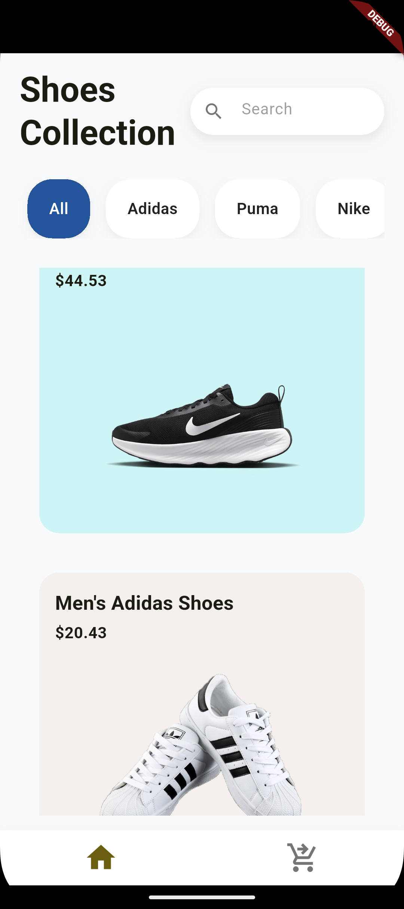
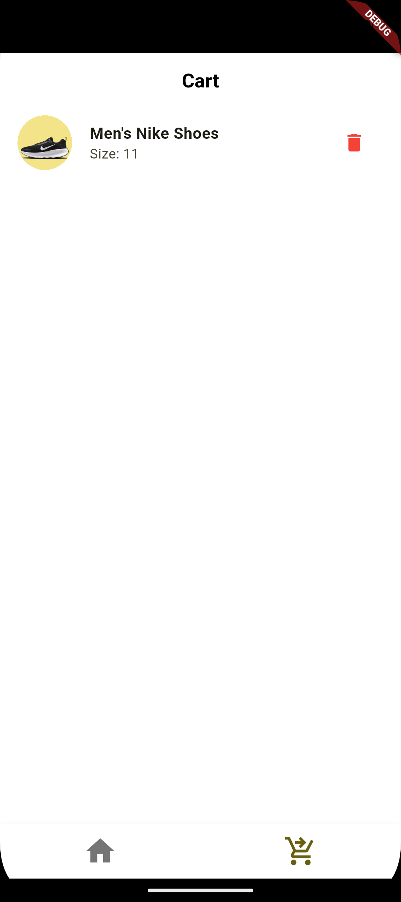

# 👟 Shoe Shopping App

A simple shoe shopping mobile application with a clean and minimal UI.  
This app demonstrates basic e-commerce functionality including product listing, product details, and a cart system.

---

## ✨ Features

- 🏠 **Home Page**
  - Displays a list of available shoes
  - Shows product image, name, and price
  - Clean and minimal UI

- 📄 **Product Detail Page**
  - Detailed view of the selected shoe
  - Product image, name, price, and description
  - Add to Cart functionality

- 🛒 **Cart Page**
  - View added products
  - Increase or decrease quantity
  - Remove products from the cart
  - Automatic total price calculation

---

## 📸 App Screenshots

| Home Page | Product Details | Cart |
|----------|----------------|------|
|  |  |  |

---

## 🛠️ Tech Stack

- **Framework:** Flutter  
- **Language:** Dart  
- **State Management:** Basic state management (setState / simple provider)  
- **Assets:** Local images  

---

## 🚀 Getting Started

### Prerequisites

- Flutter SDK installed
- Android Studio or VS Code
- Emulator or physical device

### Run the App

```bash
flutter pub get
flutter run


